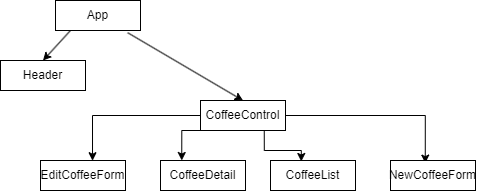

# Coffee Shop

#### Tracks inventory for our coffee shop

#### By Billy Lee

## Technologies Used

* _JSX_
* _React_
* _VSCode_

## Description
_This is a simple website to track the inventory of a coffee shop. You can add different coffee's into the website. Attributes such as coffee name, quanitity, origin, price, and roast type. There is full CRUD capabilities allowing you to edit the stock of coffee at any time._

## Setup/Installation Requirements

* _Visit the repository this project is located in._
* _Press the green code button and copy and the HTTPS link that ends with .git_
* _Open up your gitbash and change the directory to where you want to clone this repository._
* _in gitbash, type "git clone https://github.com/BillyLee1/coffee-shop.git" _
* _Open the project folder in VS Code by typing "code ." into gitbash_
* _Type "npm install" into gitbash to install all node modules_
* _Type "npm run start" into git bash to open up the live server_

## Diagram of Components

  

## License

_Please let me know if you see any bugs within this project. You can contact me through Discord or email me at codingbillylee@gmail.com_

[Copyright](https://opensource.org/licenses/MIT) (c) _2023_ _Billy Lee_
